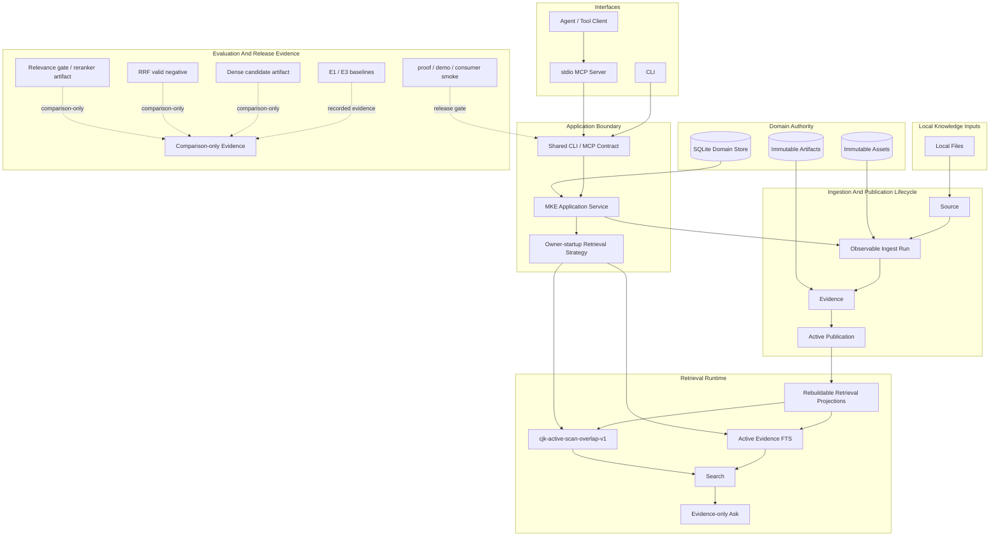

# Multimodal Knowledge Engine

[English](./README.md) | [中文](./README_CN.md)

Multimodal Knowledge Engine is a local-first, Agent-callable Evidence engine for ingesting,
searching, and asking questions over documents and media. It keeps source processing, Publication
activation, retrieval, and Agent-facing interfaces inside one verifiable local application boundary.

The [Run The Consumer Source-Pack Proof](./docs/how-to/run-consumer-source-pack-proof.md) guide
documents a source-built proof for the current source checkout as a `v0.1.3` release-candidate
verification gate.

`v0.1.3` leads with Compiled Library Export: a deterministic, read-only export of active
Publications as portable Markdown plus strict EvidenceRef JSONL. It retains the strict Evidence
provenance and external source-pack proof using the same wheel on Python 3.12/3.13 while keeping the
same narrow runtime boundary: observable ingest Runs, active Publication Search, evidence-only Ask,
retrieval evaluation artifacts, and one application service contract shared by the CLI and stdio
MCP server. It is not a hosted RAG platform.

## Verified in v0.1.3

| Capability | Evidence |
|---|---|
| Evidence lifecycle | Successful Runs can publish Evidence; failed or partial processing never becomes searchable. |
| text-layer PDF + short video fixture ingest | The proof/demo fixtures cover text-layer PDF ingest and the documented short local video fixture. |
| active-Publication Search | Search reads active Publications and returns stable page or timestamp Evidence. |
| evidence-only Ask / insufficient_evidence | Ask returns cited Evidence or `insufficient_evidence`; no LLM answer generation is used in this slice. |
| CLI + stdio MCP same application contract | CLI commands and MCP tools use the same application service layer. |
| Real stdio MCP local knowledge proof | Two synthetic PDFs flow through MCP ingest, published Runs, active Publication Search, cited Ask, and `insufficient_evidence`. |
| cjk-active-scan-overlap-v1 default owner-startup strategy | `cjk-active-scan-overlap-v1` is the shipped owner-startup CJK retrieval default. |
| proof/demo/installed-wheel consumer smoke | `mke proof run`, `mke demo --verify`, and installed-wheel consumer smoke are release gates. |
| Evidence provenance | `list_libraries_v1`, `search_library_v1`, and `ask_library_v1` return strict portable `mke.evidence_ref.v1` values. |
| external source-pack proof | One wheel is proven through the official MCP SDK in fresh Python 3.12 and Python 3.13 environments. |
| owner lifecycle and runtime hardening | Deadlines, bounded output, cancellation, subprocess cleanup, stable redacted failures, and atomic transitions are hardened. |
| Compiled Library Export | Active Publications export through `mke.compiled_library_export.v1`, readable `mke.compiled_markdown.v1`, and authoritative `mke.evidence_ref.v1` JSONL. |
| PDF OCR Phase 0 evidence | PP-OCRv6 medium is the selected production-planning baseline; PaddleOCR-VL 1.6 is a validated comparison candidate. This is not production OCR. |



SQLite is the domain truth for the first Pilot. Retrieval indexes are rebuildable projections,
Assets and Artifacts are immutable, and Search/Ask read only active Publications.

## What this release proves

`v0.1.3` is small by product surface, but it exercises the parts that make the system auditable:
the Evidence lifecycle, active Publication switching, a CLI/MCP application service contract,
Evidence provenance, the external source-pack proof, same-wheel Python 3.12/3.13 verification,
owner lifecycle and runtime hardening, and retrieval evaluation artifacts that record accepted
and rejected retrieval candidates. PDF OCR Phase 0 is bounded planning evidence, not production
OCR, a public OCR runtime, or a provider promotion. OCR remains excluded from production behavior.

| Retrieval evidence | v0.1.3 status | Boundary |
|---|---|---|
| Shipped runtime | lexical search plus `cjk-active-scan-overlap-v1` for owner-startup CJK active scan. | Search/Ask/MCP read active Publication Evidence through the same application service. |
| Comparison-only evidence | dense exact-cosine, RRF fusion, and relevance gate / reranker artifacts are recorded. | This does not change normal Search, Ask, MCP, or the runtime default. |
| Not included | query rewrite, HyDE, production OCR, HTTP/UI, and API adapters are not included. | They are not `v0.1.3` runtime behavior or release claims. |

## Quick Verify

```bash
uv sync --locked
uv run mke proof run
uv run mke demo --verify
```

For the full release verification set:

```bash
uv run pytest -q
uv run ruff check .
uv run pyright
uv build
uv run mke proof run
uv run mke demo --verify
uv run python scripts/release_presentation_audit.py --root .
uv run python scripts/release_consumer_smoke.py \
  --wheel dist/multimodal_knowledge_engine-0.1.3-py3-none-any.whl --json
```

## Local Knowledge Proof

The repository includes a public-safe synthetic proof of the Agent-callable local knowledge flow.
It starts the real stdio MCP server, ingests two local PDFs through MCP tools, inspects their Runs,
then verifies active Publication Search, cited evidence-only Ask, and `insufficient_evidence`.

```bash
UV_OFFLINE=1 uv run python scripts/local_knowledge_proof.py
```

The proof is offline and model-free. Its report contains only aggregate outcomes, not local paths,
transient identifiers, or Evidence text. See
[Run The Local Knowledge Proof](./docs/how-to/run-local-knowledge-proof.md).

## CLI And MCP

Generic Agent consumers can opt into strict read-only provenance through `list_libraries_v1`,
`search_library_v1`, and `ask_library_v1`. Search and Ask share `mke.evidence_ref.v1`, linking
Evidence to its Source, source-byte `content_fingerprint`, active Publication revision, producing
Run, locator, and text without changing the five legacy tools.

```bash
UV_OFFLINE=1 uv run python scripts/evidence_provenance_proof.py
```

The core CLI path uses a local SQLite database:

```bash
uv run mke --db .tmp/mke.sqlite ingest tests/fixtures/pdf/text-layer.pdf
uv run mke --db .tmp/mke.sqlite search trustworthy
uv run mke --db .tmp/mke.sqlite ask "publication active"
uv run mke --db .tmp/mke.sqlite run get <run_id>
```

The Agent-facing MCP server runs over stdio and uses the same application service layer:

```bash
uv run mke --db .tmp/mke.sqlite mcp --allowed-root .
```

MCP tools can ingest allowed local files, inspect Runs, Search active Evidence, and Ask
evidence-only questions. MCP requests cannot override provider, model, download policy, or
request-time retrieval strategy.

## Current CJK Runtime

`cjk-active-scan-overlap-v1` is the shipped runtime default. It compiles each query once with the
numeric policy:

- compiled non-empty queries stay on active FTS5, including zero-hit results;
- eligible compiled-empty CJK queries use a bounded scan over active Publication Evidence;
- ineligible compiled-empty queries return stable validation results.

The active scan creates no persistent CJK projection and requires no migration. The primary rollback
strategy is `numeric-grouping-v1`; `current` remains the lower-level rollback.

```bash
uv run mke --db .tmp/mke.sqlite \
  --retrieval-strategy cjk-active-scan-overlap-v1 \
  search "蓝湖缓存服务 不完整索引"
```

## E3 Release Decision Table

| Stage | Result | Runtime impact |
|---|---|---|
| E3-A Chinese baseline | Baseline recorded; current lexical miss modes identified. | None |
| E3-B CJK lexical candidate | `cjk-trigram-overlap-v1` comparison passed. | None |
| E3-F CJK active-scan runtime | `cjk-active-scan-overlap-v1` promoted as default owner-startup strategy. | Shipped runtime |
| E3-C dense candidate | Qwen3 exact-cosine dense comparison completed; E3-D eligible. | None |
| E3-D RRF fusion | Valid negative; recall improved but refusal collapsed. | None |
| E3-E relevance gate/reranker | Development passed, holdout observed, holdout gate failed. | None |

E3-C dense, E3-D RRF, and E3-E relevance-gate/reranker work are comparison-only evidence in
`v0.1.3`, not runtime behavior. They do not change Search, Ask, MCP, owner startup, Publication,
ingestion, or runtime defaults.

## Boundaries

`v0.1.3` does not include dense retrieval execution, hybrid/RRF execution, reranker execution, query
rewrite, HyDE, segmentation rewrite, scanned-PDF OCR, arbitrary video processing, HTTP, UI, public
API adapters, LangChain, LlamaIndex, LangGraph, Milvus, Redis, pgvector, bundled model weights, or
hosted multi-tenant coordination.

Optional local transcription and embedding paths remain explicit operator actions. They are not
required for the core proof, demo, CLI ingest, MCP execution, or consumer smoke.

## Compiled Library Export

This release adds a deterministic, read-only `mke library export` command. It writes
every active Publication to portable Markdown and a matching `mke.evidence_ref.v1` JSONL sidecar.
The Markdown is a readable derivative; the JSONL records remain the machine authority for exact
page or timestamp provenance. The export contains active Publication text and provenance; it does
not reconstruct source layout and excludes original Source bytes.

> MKE can deterministically export active Publications as portable Markdown with exact page or
> timestamp Evidence provenance, validated through an installed-wheel external consumer proof.

> The exported Markdown was ingested and compiled in an isolated LLM Wiki workflow, preserving a
> return path to MKE's authoritative content fingerprint and Evidence sidecars for local-Agent use.

This bounded local proof does not make LLM Wiki an MKE dependency, Evidence authority, bundled
integration, hosted service, or production deployment. The package identity is `v0.1.3`. OCR Phase
0 records bounded local viability evidence on a fixed synthetic corpus; it is not production OCR.

See [Export A Compiled Library](./docs/how-to/export-compiled-library.md) and
[Run The Compiled Library Export Proof](./docs/how-to/run-compiled-library-export-proof.md).

## Documentation

- [Release notes](./docs/releases/v0.1.3.md)
- [Verify The Release](./docs/how-to/verify-release.md)
- [Documentation index](./docs/README.md)
- [Run The Local Product Proof](./docs/how-to/run-local-product-proof.md)
- [Run The Local Knowledge Proof](./docs/how-to/run-local-knowledge-proof.md)
- [Use MKE As A Local MCP Server](./docs/how-to/use-mke-mcp.md)
- [MCP Contract Reference](./docs/reference/mcp-contract.md)
- [Run The Evidence Provenance Proof](./docs/how-to/run-evidence-provenance-proof.md)
- [Enable Bounded CJK Retrieval](./docs/how-to/enable-cjk-retrieval.md)
- [Run Retrieval Evaluation](./docs/how-to/run-retrieval-evaluation.md)
- [Run The Chinese Retrieval Evaluation](./docs/how-to/run-chinese-retrieval-evaluation.md)
- [Prepare Local Embeddings](./docs/how-to/prepare-local-embeddings.md)
- [Evaluate The Dense Retrieval Candidate](./docs/how-to/evaluate-dense-retrieval.md)
- [Evaluate The Hybrid RRF Retrieval Candidate](./docs/how-to/evaluate-hybrid-rrf-retrieval.md)
- [Evaluate The Relevance Gate Reranker Candidate](./docs/how-to/evaluate-relevance-gate-reranker.md)
- [Export A Compiled Library](./docs/how-to/export-compiled-library.md)
- [Run The Compiled Library Export Proof](./docs/how-to/run-compiled-library-export-proof.md)

Long-lived architecture decisions are in [docs/decisions/](./docs/decisions/). Approved
implementation history is in [docs/superpowers/](./docs/superpowers/).

## Development

```bash
uv run pytest -q
uv run ruff check .
uv run pyright
uv build
```

See [CONTRIBUTING.md](./CONTRIBUTING.md) for the development workflow and [SECURITY.md](./SECURITY.md)
for responsible vulnerability reporting.

## License

MIT. See [LICENSE](./LICENSE).
