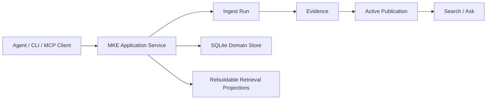

# Multimodal Knowledge Engine

[English](./README.md) | [中文](./README_CN.md)

Multimodal Knowledge Engine is a local-first, Agent-callable Evidence engine for ingesting,
searching, and asking questions over documents and media.

`v0.1.0` is the first public small version. It proves a narrow but complete local Evidence loop:
observable ingest Runs, active Publication Search, evidence-only Ask, and one application contract
shared by the CLI and stdio MCP server. It is not a hosted RAG platform.

## Verified in v0.1.0

| Capability | Evidence |
|---|---|
| Evidence lifecycle | Successful Runs can publish Evidence; failed or partial processing never becomes searchable. |
| text-layer PDF + short video fixture ingest | The proof/demo fixtures cover text-layer PDF ingest and the documented short local video fixture. |
| active-Publication Search | Search reads active Publications and returns stable page or timestamp Evidence. |
| evidence-only Ask / insufficient_evidence | Ask returns cited Evidence or `insufficient_evidence`; no LLM answer generation is used in this slice. |
| CLI + stdio MCP same application contract | CLI commands and MCP tools use the same application service layer. |
| cjk-active-scan-overlap-v1 default owner-startup strategy | `cjk-active-scan-overlap-v1` is the shipped owner-startup CJK retrieval default. |
| proof/demo/installed-wheel consumer smoke | `mke proof run`, `mke demo --verify`, and installed-wheel consumer smoke are release gates. |



SQLite is the domain truth for the first Pilot. Retrieval indexes are rebuildable projections,
Assets and Artifacts are immutable, and Search/Ask read only active Publications.

## Quick Verify

```bash
uv sync --locked
uv run mke proof run
uv run mke demo --verify
```

For the full release verification set:

```bash
uv run pytest -q
uv run ruff check .
uv run pyright
uv build
uv run mke proof run
uv run mke demo --verify
uv run python scripts/release_presentation_audit.py --root .
uv run python scripts/release_consumer_smoke.py --wheel dist/*.whl --json
```

## CLI And MCP

The core CLI path uses a local SQLite database:

```bash
uv run mke --db .tmp/mke.sqlite ingest tests/fixtures/pdf/text-layer.pdf
uv run mke --db .tmp/mke.sqlite search trustworthy
uv run mke --db .tmp/mke.sqlite ask "publication active"
uv run mke --db .tmp/mke.sqlite run get <run_id>
```

The Agent-facing MCP server runs over stdio and uses the same application service layer:

```bash
uv run mke --db .tmp/mke.sqlite mcp --allowed-root .
```

MCP tools can ingest allowed local files, inspect Runs, Search active Evidence, and Ask
evidence-only questions. MCP requests cannot override provider, model, download policy, or
request-time retrieval strategy.

## Current CJK Runtime

`cjk-active-scan-overlap-v1` is the shipped runtime default. It compiles each query once with the
numeric policy:

- compiled non-empty queries stay on active FTS5, including zero-hit results;
- eligible compiled-empty CJK queries use a bounded scan over active Publication Evidence;
- ineligible compiled-empty queries return stable validation results.

The active scan creates no persistent CJK projection and requires no migration. The primary rollback
strategy is `numeric-grouping-v1`; `current` remains the lower-level rollback.

```bash
uv run mke --db .tmp/mke.sqlite \
  --retrieval-strategy cjk-active-scan-overlap-v1 \
  search "蓝湖缓存服务 不完整索引"
```

## E3 Release Decision Table

| Stage | Result | Runtime impact |
|---|---|---|
| E3-A Chinese baseline | Baseline recorded; current lexical miss modes identified. | None |
| E3-B CJK lexical candidate | `cjk-trigram-overlap-v1` comparison passed. | None |
| E3-F CJK active-scan runtime | `cjk-active-scan-overlap-v1` promoted as default owner-startup strategy. | Shipped runtime |
| E3-C dense candidate | Qwen3 exact-cosine dense comparison completed; E3-D eligible. | None |
| E3-D RRF fusion | Valid negative; recall improved but refusal collapsed. | None |
| E3-E relevance gate/reranker | Development passed, holdout observed, holdout gate failed. | None |

E3-C dense, E3-D RRF, and E3-E relevance-gate/reranker work are comparison-only evidence in
`v0.1.0`, not runtime behavior. They do not change Search, Ask, MCP, owner startup, Publication,
ingestion, or runtime defaults.

## Boundaries

`v0.1.0` does not include dense retrieval execution, hybrid/RRF execution, reranker execution, query
rewrite, HyDE, segmentation rewrite, scanned-PDF OCR, arbitrary video processing, HTTP, UI, public
API adapters, LangChain, LlamaIndex, LangGraph, Milvus, Redis, pgvector, bundled model weights, or
hosted multi-tenant coordination.

Optional local transcription and embedding paths remain explicit operator actions. They are not
required for the core proof, demo, CLI ingest, MCP execution, or consumer smoke.

## Documentation

- [Release notes](./docs/releases/v0.1.0.md)
- [Verify The Release](./docs/how-to/verify-release.md)
- [Documentation index](./docs/README.md)
- [Run The Local Product Proof](./docs/how-to/run-local-product-proof.md)
- [Use MKE As A Local MCP Server](./docs/how-to/use-mke-mcp.md)
- [Enable Bounded CJK Retrieval](./docs/how-to/enable-cjk-retrieval.md)
- [Run Retrieval Evaluation](./docs/how-to/run-retrieval-evaluation.md)
- [Run The Chinese Retrieval Evaluation](./docs/how-to/run-chinese-retrieval-evaluation.md)
- [Prepare Local Embeddings](./docs/how-to/prepare-local-embeddings.md)
- [Evaluate The Dense Retrieval Candidate](./docs/how-to/evaluate-dense-retrieval.md)
- [Evaluate The Hybrid RRF Retrieval Candidate](./docs/how-to/evaluate-hybrid-rrf-retrieval.md)
- [Evaluate The Relevance Gate Reranker Candidate](./docs/how-to/evaluate-relevance-gate-reranker.md)

Long-lived architecture decisions are in [docs/decisions/](./docs/decisions/). Approved
implementation history is in [docs/superpowers/](./docs/superpowers/).

## Development

```bash
uv run pytest -q
uv run ruff check .
uv run pyright
uv build
```

See [CONTRIBUTING.md](./CONTRIBUTING.md) for the development workflow and [SECURITY.md](./SECURITY.md)
for responsible vulnerability reporting.

## License

MIT. See [LICENSE](./LICENSE).
