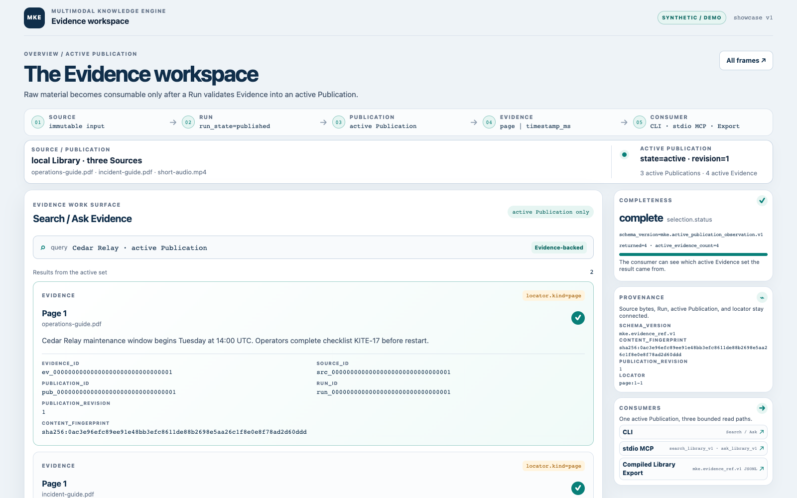
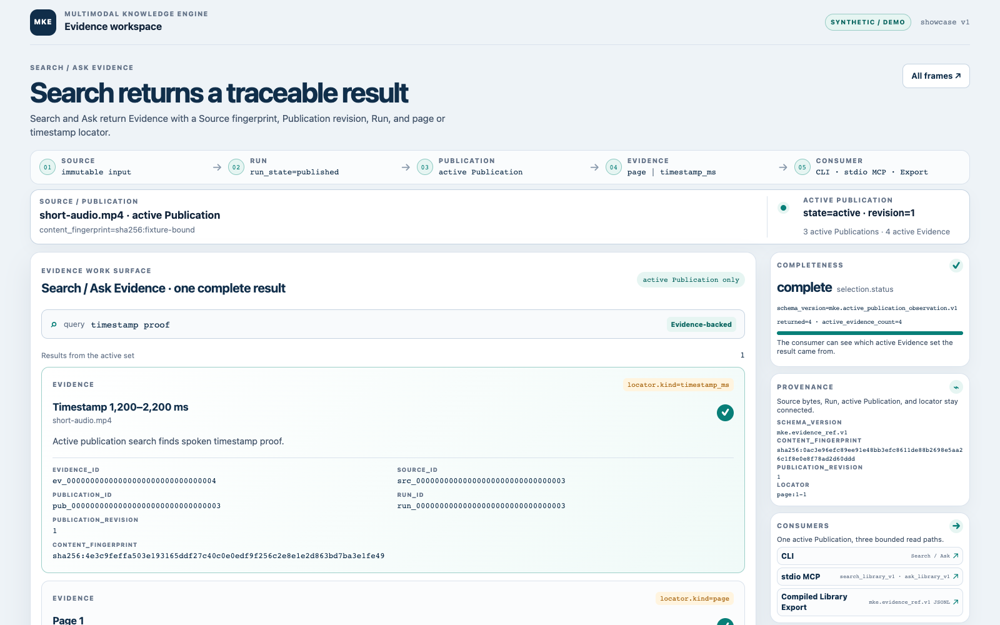
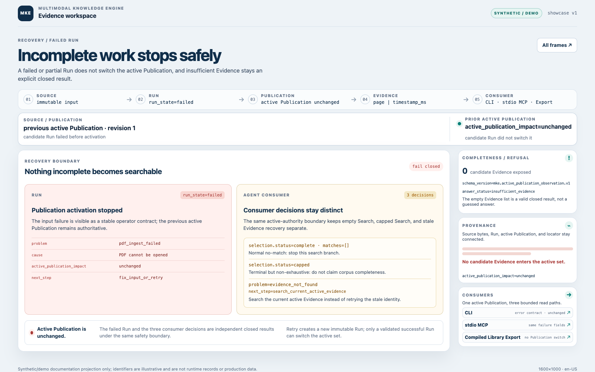
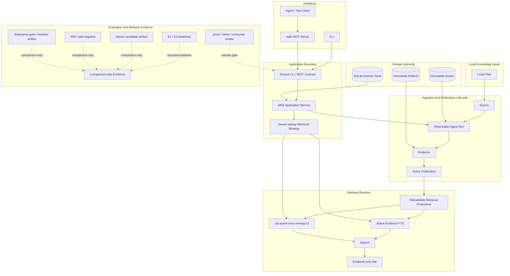

# Multimodal Knowledge Engine

[English](./README.md) | [中文](./README_CN.md)

MKE turns local source material into cited Evidence only after a Run validates it into an active
Publication; incomplete processing stays out of Search and Ask.

## Evidence workspace

Multimodal Knowledge Engine is a local-first, Agent-callable Evidence engine for ingesting,
searching, and asking questions over documents and media. It keeps source processing, Publication
activation, retrieval, and Agent-facing interfaces inside one verifiable local application boundary.

### Current default branch status

The current default branch (`main`) includes this Evidence workspace and the MCP consumer failure-branch/recovery proof. They are not included in stable `v0.1.6`; they are current-checkout documentation and proof, not a package publication, hosted deployment, model/provider change, or retrieval-quality claim.

### Five-layer relation

| Layer | What it means in the current product slice |
|---|---|
| Source | Immutable input identity, including a source-byte `content_fingerprint`. |
| Run | Observable processing attempt that can succeed, fail, or remain non-consumable. |
| active Publication | The only validated Evidence set that Search and Ask may read. |
| Evidence | A cited page or `timestamp_ms` result tied back to Source, Publication revision, and Run. |
| Consumer | CLI, stdio MCP, or Compiled Library Export reading the same contract. |

### Normal and recovery frames

These pages are a synthetic/demo projection of repository proof/export state; identifiers are
illustrative, while contract fields and lifecycle boundaries come from the current implementation.







### Four engineering judgments

1. Raw material is not an answer: a Run must validate candidate output before a Publication can be consumed.
2. Provenance is part of the result: `mke.evidence_ref.v1` carries Source, content fingerprint,
   active Publication revision, Run, and a page or `timestamp_ms` locator.
3. Incomplete work fails closed: failed or partial processing leaves
   `active_publication_impact=unchanged`, and no-match Ask returns `insufficient_evidence`.
4. Agent consumer outcomes stay distinct: an active exhaustive empty result with
   `selection.status=complete` and `matches=[]` is a normal no-match that stops this search branch;
   `selection.status=capped` is terminal but non-exhaustive; stale Evidence returns
   `problem=evidence_not_found` and points to `next_step=search_current_active_evidence`. These are
   consumer decisions at the existing contract boundary, not aggregate-v1 fields. See the [MCP context
   completeness proof](./docs/how-to/run-mcp-context-completeness-proof.md).

## Quick Verify

```bash
uv sync --locked
uv run mke proof run
uv run mke demo --verify
```

Regenerate and verify the provider-free documentation projection:

```bash
UV_OFFLINE=1 uv run python scripts/generate_evidence_workspace.py --render
UV_OFFLINE=1 uv run python scripts/generate_evidence_workspace.py --verify
```

## MCP, Export, provenance, and release proof

- [Local Knowledge Proof](./docs/how-to/run-local-knowledge-proof.md) exercises stdio MCP ingest,
  active Publication Search, cited Ask, and `insufficient_evidence` over repository fixture PDFs.
- [Evidence Provenance Proof](./docs/how-to/run-evidence-provenance-proof.md) verifies the
  `mke.evidence_ref.v1` Source/Publication/Run/locator graph.
- [Compiled Library Export](./docs/how-to/export-compiled-library.md) writes active Publications
  as portable Markdown plus authoritative Evidence JSONL.
- [Release verification](./docs/how-to/verify-release.md) and the current release notes preserve
  the broader release and consumer gates.

## Detailed contracts and history

The sections below retain the detailed release record, proof commands, contracts, boundaries,
and implementation history. They are navigation and evidence references, not additional runtime
surfaces.

`v0.1.7` keeps the completeness-aware local stdio MCP Agent path current, carries forward atomic
PDF intake-report publication, and records the bounded MCP consumer recovery and CJK scan-budget
mapping:
`search_library_v2` reports bounded selection completeness and `read_evidence_v1` reconstructs
exact active Evidence with a final digest. Normal no-match, capped non-exhaustive selection, and
`evidence_not_found` recovery remain distinct; `cjk_scan_budget_exceeded` directs the Agent to
`narrow_query_or_use_projection_strategy`. Equal-score ordering is deterministic; this is not a
relevance-improvement or runtime-promotion claim. See [v0.1.7](./docs/releases/v0.1.7.md).

The [Run The Consumer Source-Pack Proof](./docs/how-to/run-consumer-source-pack-proof.md) guide
documents a source-built regression and consumer proof for the current source checkout. It was a
historical `v0.1.4` release-candidate verification gate.

`v0.1.4` adds bounded direct-audio intake for local MP3, WAV/PCM, and M4A/AAC clips while retaining
Compiled Library Export, strict Evidence provenance, and the external source-pack proof using the
same wheel on Python 3.12/3.13. The runtime boundary remains narrow: observable ingest Runs, active
Publication Search, evidence-only Ask, retrieval evaluation artifacts, and one application service
contract shared by Python, CLI, and stdio MCP. It is not a hosted RAG platform.

## Verified in v0.1.4

| Capability | Evidence |
|---|---|
| Evidence lifecycle | Successful Runs can publish Evidence; failed or partial processing never becomes searchable. |
| text-layer PDF + short video fixture ingest | The proof/demo fixtures cover text-layer PDF ingest and the documented short local video fixture. |
| active-Publication Search | Search reads active Publications and returns stable page or timestamp Evidence. |
| evidence-only Ask / insufficient_evidence | Ask returns cited Evidence or `insufficient_evidence`; no LLM answer generation is used in this slice. |
| CLI + stdio MCP same application contract | CLI commands and MCP tools use the same application service layer. |
| Real stdio MCP local knowledge proof | Two synthetic PDFs flow through MCP ingest, published Runs, active Publication Search, cited Ask, and `insufficient_evidence`. |
| cjk-active-scan-overlap-v1 default owner-startup strategy | `cjk-active-scan-overlap-v1` is the shipped owner-startup CJK retrieval default. |
| proof/demo/installed-wheel consumer smoke | `mke proof run`, `mke demo --verify`, and installed-wheel consumer smoke are release gates. |
| Evidence provenance | `list_libraries_v1`, `search_library_v1`, and `ask_library_v1` return strict portable `mke.evidence_ref.v1` values. |
| external source-pack proof | One wheel is proven through the official MCP SDK in fresh Python 3.12 and Python 3.13 environments. |
| owner lifecycle and runtime hardening | Deadlines, bounded output, cancellation, subprocess cleanup, stable redacted failures, and atomic transitions are hardened. |
| Compiled Library Export | Active Publications export through `mke.compiled_library_export.v1`, readable `mke.compiled_markdown.v1`, and authoritative `mke.evidence_ref.v1` JSONL. |
| Bounded direct audio | Cache-only MP3, WAV/PCM, and M4A/AAC clips up to 15 minutes and 100 MiB publish timestamp Evidence on an explicitly supervised Darwin arm64 owner. |
| PDF OCR Phase 0 evidence | PP-OCRv6 medium is the selected production-planning baseline; PaddleOCR-VL 1.6 is a validated comparison candidate. This is not production OCR. |


```mermaid
flowchart TB
    subgraph Inputs["Local Knowledge Inputs"]
        LocalFiles["Local Files"]
    end

    subgraph Interfaces["Interfaces"]
        Agent["Agent / Tool Client"]
        CLI["CLI"]
        MCP["stdio MCP Server"]
    end

    subgraph Application["Application Boundary"]
        App["MKE Application Service"]
        Contract["Shared CLI / MCP Contract"]
        Strategy["Owner-startup Retrieval Strategy"]
    end

    subgraph Lifecycle["Ingestion And Publication Lifecycle"]
        Source["Source"]
        Run["Observable Ingest Run"]
        Evidence["Evidence"]
        Publication["Active Publication"]
    end

    subgraph Authority["Domain Authority"]
        Store[("SQLite Domain Store")]
        Assets[("Immutable Assets")]
        Artifacts[("Immutable Artifacts")]
    end

    subgraph Runtime["Retrieval Runtime"]
        Projection["Rebuildable Retrieval Projections"]
        FTS["Active Evidence FTS"]
        CJK["cjk-active-scan-overlap-v1"]
        Search["Search"]
        Ask["Evidence-only Ask"]
    end

    subgraph Evaluation["Evaluation And Release Evidence"]
        Baselines["E1 / E3 baselines"]
        Dense["Dense candidate artifact"]
        RRF["RRF valid negative"]
        Reranker["Relevance gate / reranker artifact"]
        Proof["proof / demo / consumer smoke"]
        Comparison["Comparison-only Evidence"]
    end

    LocalFiles --> Source
    Agent --> MCP
    CLI --> Contract
    MCP --> Contract
    Contract --> App
    App --> Strategy
    App --> Run
    Source --> Run
    Run --> Evidence
    Evidence --> Publication
    Publication --> Projection
    Projection --> FTS
    Projection --> CJK
    Strategy --> FTS
    Strategy --> CJK
    FTS --> Search
    CJK --> Search
    Search --> Ask
    Store --> App
    Assets --> Run
    Artifacts --> Evidence
    Baselines -. recorded evidence .-> Comparison
    Dense -. comparison-only .-> Comparison
    RRF -. comparison-only .-> Comparison
    Reranker -. comparison-only .-> Comparison
    Proof -. release gate .-> Contract
```

SQLite is the domain truth for the first Pilot. Retrieval indexes are rebuildable projections,
Assets and Artifacts are immutable, and Search/Ask read only active Publications.

## What this release proves

`v0.1.4` is small by product surface, but it exercises the parts that make the system auditable:
the Evidence lifecycle, active Publication switching, a CLI/MCP application service contract,
Evidence provenance, the external source-pack proof, same-wheel Python 3.12/3.13 verification,
owner lifecycle and runtime hardening, bounded direct-audio timestamp Evidence, Compiled Library
Export v2, and retrieval evaluation artifacts that record accepted and rejected retrieval
candidates. PDF OCR Phase 0 is bounded planning evidence, not production OCR, a public OCR runtime,
or a provider promotion. OCR remains excluded from production behavior.

| Retrieval evidence | v0.1.4 status | Boundary |
|---|---|---|
| Shipped runtime | lexical search plus `cjk-active-scan-overlap-v1` for owner-startup CJK active scan. | Search/Ask/MCP read active Publication Evidence through the same application service. |
| Comparison-only evidence | dense exact-cosine, RRF fusion, and relevance gate / reranker artifacts are recorded. | This does not change normal Search, Ask, MCP, or the runtime default. |
| Not included | query rewrite, HyDE, production OCR, HTTP/UI, and API adapters are not included. | They are not `v0.1.4` runtime behavior or release claims. |

### Full release verification

For the full release verification set:

```bash
uv run pytest -q
uv run ruff check .
uv run pyright
uv build
uv run mke proof run
uv run mke demo --verify
uv run python scripts/release_presentation_audit.py --root .
uv run python scripts/release_consumer_smoke.py \
  --wheel dist/multimodal_knowledge_engine-0.1.7-py3-none-any.whl --json
```

## Local Knowledge Proof

The repository includes a public-safe synthetic proof of the Agent-callable local knowledge flow.
It starts the real stdio MCP server, ingests two local PDFs through MCP tools, inspects their Runs,
then verifies active Publication Search, cited evidence-only Ask, and `insufficient_evidence`.

```bash
UV_OFFLINE=1 uv run python scripts/local_knowledge_proof.py
```

The proof is offline and model-free. Its report contains only aggregate outcomes, not local paths,
transient identifiers, or Evidence text. See
[Run The Local Knowledge Proof](./docs/how-to/run-local-knowledge-proof.md).

## CLI And MCP

Generic Agent consumers can opt into strict read-only provenance through `list_libraries_v1`,
`search_library_v1`, and `ask_library_v1`. Search and Ask share `mke.evidence_ref.v1`, linking
Evidence to its Source, source-byte `content_fingerprint`, active Publication revision, producing
Run, locator, and text without changing the five legacy tools.

```bash
UV_OFFLINE=1 uv run python scripts/evidence_provenance_proof.py
```

The core CLI path uses a local SQLite database:

```bash
uv run mke --db .tmp/mke.sqlite ingest tests/fixtures/pdf/text-layer.pdf
uv run mke --db .tmp/mke.sqlite search trustworthy
uv run mke --db .tmp/mke.sqlite ask "publication active"
uv run mke --db .tmp/mke.sqlite run get <run_id>
```

The Agent-facing MCP server runs over stdio and uses the same application service layer:

```bash
uv run mke --db .tmp/mke.sqlite mcp --allowed-root .
```

MCP tools can ingest allowed local files, inspect Runs, Search active Evidence, and Ask
evidence-only questions. MCP requests cannot override provider, model, download policy, or
request-time retrieval strategy.

## Current CJK Runtime

`cjk-active-scan-overlap-v1` is the shipped runtime default. It compiles each query once with the
numeric policy:

- compiled non-empty queries stay on active FTS5, including zero-hit results;
- eligible compiled-empty CJK queries use a bounded scan over active Publication Evidence;
- ineligible compiled-empty queries return stable validation results.

The active scan creates no persistent CJK projection and requires no migration. The primary rollback
strategy is `numeric-grouping-v1`; `current` remains the lower-level rollback.

```bash
uv run mke --db .tmp/mke.sqlite \
  --retrieval-strategy cjk-active-scan-overlap-v1 \
  search "蓝湖缓存服务 不完整索引"
```

## E3 Release Decision Table

| Stage | Result | Runtime impact |
|---|---|---|
| E3-A Chinese baseline | Baseline recorded; current lexical miss modes identified. | None |
| E3-B CJK lexical candidate | `cjk-trigram-overlap-v1` comparison passed. | None |
| E3-F CJK active-scan runtime | `cjk-active-scan-overlap-v1` promoted as default owner-startup strategy. | Shipped runtime |
| E3-C dense candidate | Qwen3 exact-cosine dense comparison completed; E3-D eligible. | None |
| E3-D RRF fusion | Valid negative; recall improved but refusal collapsed. | None |
| E3-E relevance gate/reranker | Development passed, holdout observed, holdout gate failed. | None |

E3-C dense, E3-D RRF, and E3-E relevance-gate/reranker work are comparison-only evidence in
`v0.1.3`, not runtime behavior. They do not change Search, Ask, MCP, owner startup, Publication,
ingestion, or runtime defaults.

## Boundaries

`v0.1.3` does not include dense retrieval execution, hybrid/RRF execution, reranker execution, query
rewrite, HyDE, segmentation rewrite, scanned-PDF OCR, arbitrary video processing, HTTP, UI, public
API adapters, LangChain, LlamaIndex, LangGraph, Milvus, Redis, pgvector, bundled model weights, or
hosted multi-tenant coordination.

Optional local transcription and embedding paths remain explicit operator actions. They are not
required for the core proof, demo, CLI ingest, MCP execution, or consumer smoke.

## Compiled Library Export

This release adds a deterministic, read-only `mke library export` command. It writes
every active Publication to portable Markdown and a matching `mke.evidence_ref.v1` JSONL sidecar.
The Markdown is a readable derivative; the JSONL records remain the machine authority for exact
page or timestamp provenance. The export contains active Publication text and provenance; it does
not reconstruct source layout and excludes original Source bytes.

> MKE can deterministically export active Publications as portable Markdown with exact page or
> timestamp Evidence provenance, validated through an installed-wheel external consumer proof.

v0.1.3's generic proof did not verify LLM Wiki compatibility; separate post-release acceptance
evidence is recorded below.

### Post-Release LLM Wiki Compatibility Evidence

> The exported Markdown was ingested and compiled in an isolated LLM Wiki workflow, preserving a
> return path to MKE's authoritative content fingerprint and Evidence sidecars for local-Agent use.

This evidence does not make LLM Wiki an MKE dependency or Evidence authority, and it does not
provide a bundled adapter, automatic sync, hosted service, production deployment, real-user
adoption, or general multimodal understanding. LLM Wiki compatibility was not shipped by v0.1.3.

The fixed synthetic acceptance used a read-only isolated local query route for exactly one page
query and one timestamp query. Both exact responses returned through the immutable exported
Markdown to the canonical manifest and `mke.evidence_ref.v1` sidecars. OCR Phase 0 remains bounded
local viability evidence and is not production OCR.

See [Export A Compiled Library](./docs/how-to/export-compiled-library.md) and
[View A Compiled Library Export Offline](./docs/how-to/view-compiled-library.md) for the direct-open
offline reader, plus
[Run The Compiled Library Export Proof](./docs/how-to/run-compiled-library-export-proof.md).

## Bounded Direct Audio

Direct audio is a bounded v0.1.4 capability. It adds MP3, WAV/PCM, and M4A/AAC voice-note and
clip/excerpt intake through an explicitly prepared cache-only owner on Darwin arm64. The owner
must supply a positive supervision value; MKE provides no runtime budget default, recommendation,
or SLA.

Start with the offline model-free proof, then follow the Python, CLI, stdio MCP, and explicit
Export v2 golden paths in [Use bounded direct audio](docs/how-to/use-direct-audio.md). The separate
[installed-wheel proof guide](docs/how-to/run-direct-audio-proof.md) records a separately
authorized terminal observation. It used fixed MP3, WAV, and M4A fixtures on Darwin arm64 with a
prepared cache-only faster-whisper model and bounded supervision. It returned `status=passed` and
`canonical=true` across Python, CLI, stdio MCP, published Runs, timestamp Evidence, Search/Ask,
Export v2, network denial, and cleanup. This does not prove transcript accuracy, a production SLA,
hosted production, cross-platform support, arbitrary media support, hostile-media sandboxing,
business adoption, or real-user outcomes.

## Documentation

- [Release notes](./docs/releases/v0.1.7.md)
- [Verify The Release](./docs/how-to/verify-release.md)
- [Documentation index](./docs/README.md)
- [Run The Local Product Proof](./docs/how-to/run-local-product-proof.md)
- [Run The Local Knowledge Proof](./docs/how-to/run-local-knowledge-proof.md)
- [Use MKE As A Local MCP Server](./docs/how-to/use-mke-mcp.md)
- [MCP Contract Reference](./docs/reference/mcp-contract.md)
- [Run The Evidence Provenance Proof](./docs/how-to/run-evidence-provenance-proof.md)
- [Enable Bounded CJK Retrieval](./docs/how-to/enable-cjk-retrieval.md)
- [Run Retrieval Evaluation](./docs/how-to/run-retrieval-evaluation.md)
- [Run The Chinese Retrieval Evaluation](./docs/how-to/run-chinese-retrieval-evaluation.md)
- [Prepare Local Embeddings](./docs/how-to/prepare-local-embeddings.md)
- [Evaluate The Dense Retrieval Candidate](./docs/how-to/evaluate-dense-retrieval.md)
- [Evaluate The Hybrid RRF Retrieval Candidate](./docs/how-to/evaluate-hybrid-rrf-retrieval.md)
- [Evaluate The Relevance Gate Reranker Candidate](./docs/how-to/evaluate-relevance-gate-reranker.md)
- [Export A Compiled Library](./docs/how-to/export-compiled-library.md)
- [View A Compiled Library Export Offline](./docs/how-to/view-compiled-library.md)
- [Run The Compiled Library Export Proof](./docs/how-to/run-compiled-library-export-proof.md)

Long-lived architecture decisions are in [docs/decisions/](./docs/decisions/). Approved
implementation history is in [docs/superpowers/](./docs/superpowers/).

## Development

```bash
uv run pytest -q
uv run ruff check .
uv run pyright
uv build
```

See [CONTRIBUTING.md](./CONTRIBUTING.md) for the development workflow and [SECURITY.md](./SECURITY.md)
for responsible vulnerability reporting.

## License

MIT. See [LICENSE](./LICENSE).
## MCP context completeness

The canonical ten-tool inventory, completeness semantics, exact Evidence read contract, and stable
recovery operations are documented in the
[MCP contract reference](./docs/reference/mcp-contract.md). Run the installed-wheel verification
with the [MCP context completeness proof](./docs/how-to/run-mcp-context-completeness-proof.md).
