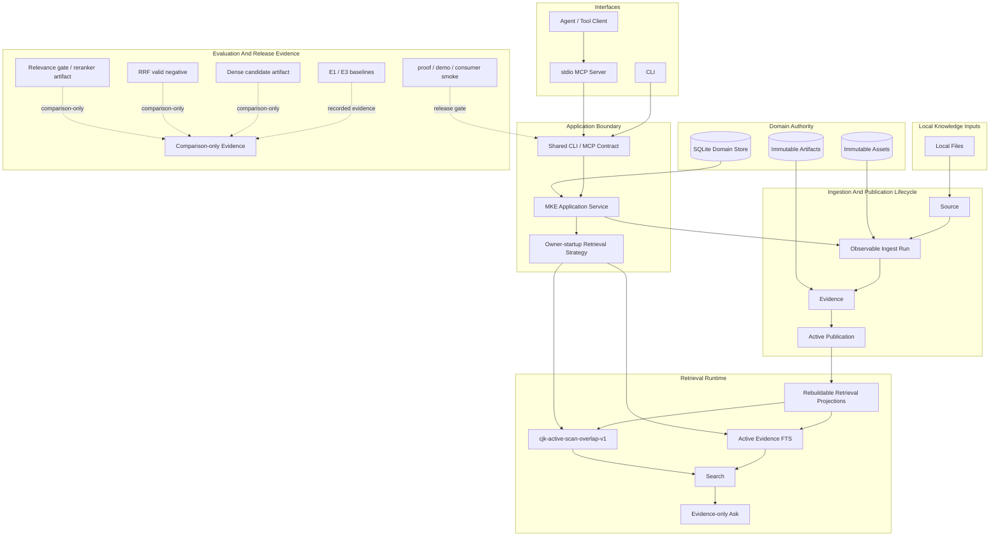

# Multimodal Knowledge Engine

[English](./README.md) | [中文](./README_CN.md)

Multimodal Knowledge Engine 是一个本地优先、可被 Agent 调用的 Evidence 引擎，用于导入、检索和问答文档与媒体资料。它把
source processing、Publication activation、retrieval 和 Agent-facing interfaces 收在同一个可验证的本地
application boundary 内。

`v0.1.3` 以 Compiled Library Export 为首要结果：把 active Publications 确定性、只读地导出为
portable Markdown 与 strict EvidenceRef JSONL。它保留 strict Evidence provenance 和 external
same-wheel Python 3.12/3.13 source-pack proof，同时保持同一条收窄的
runtime 边界：可观察 ingest Runs、active Publication Search、evidence-only Ask、retrieval evaluation
artifacts，以及 CLI 和 stdio MCP server 共享的一套 application service contract。它不是托管 RAG 平台。

## v0.1.3 已验证能力

| 能力 | 验证证据 |
|---|---|
| Evidence 生命周期 | 成功 Run 可以发布 Evidence；失败或部分处理不会进入可检索状态。 |
| text-layer PDF + short video fixture ingest | proof/demo fixtures 覆盖 text-layer PDF ingest 和文档化的短本地视频 fixture。 |
| active-Publication Search | Search 读取 active Publications，并返回稳定页码或时间戳 Evidence。 |
| evidence-only Ask / insufficient_evidence | Ask 返回带引用的 Evidence 或 `insufficient_evidence`；当前 slice 不做 LLM answer generation。 |
| CLI + stdio MCP same application contract | CLI commands 和 MCP tools 使用同一 application service layer。 |
| Real stdio MCP local knowledge proof | 两份 synthetic PDF 通过 MCP ingest、published Runs、active Publication Search、带引用 Ask 和 `insufficient_evidence` 完成闭环。 |
| cjk-active-scan-overlap-v1 default owner-startup strategy | `cjk-active-scan-overlap-v1` 是已发布的 owner-startup CJK retrieval default。 |
| proof/demo/installed-wheel consumer smoke | `mke proof run`、`mke demo --verify` 和 installed-wheel consumer smoke 都是 release gates。 |
| Evidence provenance | `list_libraries_v1`、`search_library_v1` 和 `ask_library_v1` 返回 strict portable `mke.evidence_ref.v1`。 |
| external source-pack proof | same wheel on Python 3.12/3.13，通过 official MCP SDK 在 fresh environments 中完成证明。 |
| owner lifecycle and runtime hardening | deadlines、bounded output、cancellation、subprocess cleanup、stable redacted failures 和 atomic transitions 已加固。 |
| Compiled Library Export | Active Publications 通过 `mke.compiled_library_export.v1`、readable `mke.compiled_markdown.v1` 和 authoritative `mke.evidence_ref.v1` JSONL 导出。 |
| PDF OCR Phase 0 evidence | PP-OCRv6 medium 是 selected production-planning baseline；PaddleOCR-VL 1.6 是 validated comparison candidate。This is not production OCR。 |



SQLite 是 first Pilot 的 domain truth。Retrieval indexes 是可重建 projections，Assets 和
Artifacts 不可变，Search/Ask 只读取 active Publications。

## v0.1.3 工程深度

`v0.1.3` 的产品面很小，但它验证了系统可审计性的关键部分：Evidence 生命周期、active Publication
切换、CLI/MCP application service contract、Evidence provenance、external source-pack proof、
same-wheel Python 3.12/3.13 verification、owner lifecycle and runtime hardening，以及记录已接受和已拒绝
retrieval candidates 的 retrieval evaluation artifacts。PDF OCR Phase 0 是 bounded planning
evidence；this is not production OCR、public OCR runtime 或 provider promotion。OCR 仍排除。

| Retrieval evidence | v0.1.3 状态 | 边界 |
|---|---|---|
| 已发布 runtime | lexical search 加 `cjk-active-scan-overlap-v1` owner-startup CJK active scan。 | Search/Ask/MCP 通过同一 application service 读取 active Publication Evidence。 |
| Comparison-only evidence | dense exact-cosine、RRF fusion、relevance gate / reranker artifacts 已记录。 | 它们不改变 normal Search、Ask、MCP 或 runtime default。 |
| 不包含 | query rewrite、HyDE、HTTP/UI 和 API adapters。 | Production OCR remains excluded；它们不是 `v0.1.3` runtime behavior 或 release claims。 |

## 快速验证

```bash
uv sync --locked
uv run mke proof run
uv run mke demo --verify
```

完整 release verification 命令集：

```bash
uv run pytest -q
uv run ruff check .
uv run pyright
uv build
uv run mke proof run
uv run mke demo --verify
uv run python scripts/release_presentation_audit.py --root .
uv run python scripts/release_consumer_smoke.py \
  --wheel dist/multimodal_knowledge_engine-0.1.3-py3-none-any.whl --json
```

## Local Knowledge Proof

仓库包含一条公开安全的 synthetic Agent-callable local knowledge proof。它启动真实 stdio MCP
server，通过 MCP tools 导入两份本地 PDF、检查 Runs，并验证 active Publication Search、带引用的
evidence-only Ask 和 `insufficient_evidence`。

```bash
UV_OFFLINE=1 uv run python scripts/local_knowledge_proof.py
```

这条 proof 离线运行且不使用模型。报告只包含聚合结果，不输出本地路径、临时标识符或 Evidence
原文。详见 [Run The Local Knowledge Proof](./docs/how-to/run-local-knowledge-proof.md)。

## CLI 与 MCP

通用 Agent consumer 可以显式选择 `list_libraries_v1`、`search_library_v1` 和
`ask_library_v1` strict read-only provenance contract。Search 与 Ask 共享
`mke.evidence_ref.v1`，把 Evidence 连接到 Source、source-byte `content_fingerprint`、active
Publication revision、producing Run、locator 和 text，同时保持五个 legacy tools 不变。

```bash
UV_OFFLINE=1 uv run python scripts/evidence_provenance_proof.py
```

核心 CLI 路径使用本地 SQLite database：

```bash
uv run mke --db .tmp/mke.sqlite ingest tests/fixtures/pdf/text-layer.pdf
uv run mke --db .tmp/mke.sqlite search trustworthy
uv run mke --db .tmp/mke.sqlite ask "publication active"
uv run mke --db .tmp/mke.sqlite run get <run_id>
```

Agent-facing MCP server 通过 stdio 运行，并复用同一 application service layer：

```bash
uv run mke --db .tmp/mke.sqlite mcp --allowed-root .
```

MCP tools 可以导入 allowed local files、检查 Runs、Search active Evidence，以及执行
evidence-only Ask。MCP request 不能覆盖 provider、model、download policy 或 request-time
retrieval strategy。

## 当前 CJK Runtime

`cjk-active-scan-overlap-v1` 是已发布 runtime default。它会用 numeric policy 编译每个 query：

- compiled non-empty query 始终走 active FTS5，包括 zero-hit；
- eligible compiled-empty CJK query 使用 active Publication Evidence 上的有界扫描；
- ineligible compiled-empty query 返回稳定 validation result。

Active scan 不创建 persistent CJK projection，也不需要 migration。主要 rollback strategy 是
`numeric-grouping-v1`；`current` 保留为更底层 rollback。

```bash
uv run mke --db .tmp/mke.sqlite \
  --retrieval-strategy cjk-active-scan-overlap-v1 \
  search "蓝湖缓存服务 不完整索引"
```

## E3 Release Decision Table

| Stage | Result | Runtime impact |
|---|---|---|
| E3-A Chinese baseline | Baseline recorded; current lexical miss modes identified. | None |
| E3-B CJK lexical candidate | `cjk-trigram-overlap-v1` comparison passed. | None |
| E3-F CJK active-scan runtime | `cjk-active-scan-overlap-v1` promoted as default owner-startup strategy. | Shipped runtime |
| E3-C dense candidate | Qwen3 exact-cosine dense comparison completed; E3-D eligible. | None |
| E3-D RRF fusion | Valid negative; recall improved but refusal collapsed. | None |
| E3-E relevance gate/reranker | Development passed, holdout observed, holdout gate failed. | None |

E3-C dense、E3-D RRF、E3-E relevance-gate/reranker 在 `v0.1.3` 中都是 comparison-only
evidence，不是 runtime behavior。它们不改变 Search、Ask、MCP、owner startup、Publication、
ingestion 或 runtime defaults。

## 边界

`v0.1.3` 不包含 dense retrieval execution、hybrid/RRF execution、reranker execution、query
rewrite、HyDE、segmentation rewrite、scanned-PDF OCR、任意视频处理、HTTP、UI、public API
adapter、LangChain、LlamaIndex、LangGraph、Milvus、Redis、pgvector、bundled model weights 或托管
多租户协调。

可选 local transcription 和 embedding 路径仍是显式 operator action。它们不是 core proof、demo、
CLI ingest、MCP execution 或 consumer smoke 的要求。

## Compiled Library Export

本次 release 新增确定性的只读 `mke library export` 命令。它把每个 active Publication
写为可移植 Markdown，并写出对应的 `mke.evidence_ref.v1` JSONL sidecar。Markdown 是便于阅读的
derivative；JSONL record 仍是精确 page 或 timestamp provenance 的 machine authority。导出包含
active Publication text 和 provenance，不包含原始 Source bytes，也不重建 layout。

> MKE can deterministically export active Publications as portable Markdown with exact page or
> timestamp Evidence provenance, validated through an installed-wheel external consumer proof.

> The exported Markdown was ingested and compiled in an isolated LLM Wiki workflow, preserving a
> return path to MKE's authoritative content fingerprint and Evidence sidecars for local-Agent use.

这项有界本地 proof 不会使 LLM Wiki 成为 MKE dependency、Evidence authority、bundled
integration、hosted service 或 production deployment。package identity 是 `v0.1.3`。OCR Phase 0
只记录固定 synthetic corpus 上的有界本地 viability evidence，不是 production OCR。

参见 [Export A Compiled Library](./docs/how-to/export-compiled-library.md) 和
[Run The Compiled Library Export Proof](./docs/how-to/run-compiled-library-export-proof.md)。

## 文档

- [Release notes](./docs/releases/v0.1.3.md)
- [Verify The Release](./docs/how-to/verify-release.md)
- [Documentation index](./docs/README.md)
- [Run The Local Product Proof](./docs/how-to/run-local-product-proof.md)
- [Run The Local Knowledge Proof](./docs/how-to/run-local-knowledge-proof.md)
- [Use MKE As A Local MCP Server](./docs/how-to/use-mke-mcp.md)
- [MCP Contract Reference](./docs/reference/mcp-contract.md)
- [Run The Evidence Provenance Proof](./docs/how-to/run-evidence-provenance-proof.md)
- [Enable Bounded CJK Retrieval](./docs/how-to/enable-cjk-retrieval.md)
- [Run Retrieval Evaluation](./docs/how-to/run-retrieval-evaluation.md)
- [Run The Chinese Retrieval Evaluation](./docs/how-to/run-chinese-retrieval-evaluation.md)
- [Prepare Local Embeddings](./docs/how-to/prepare-local-embeddings.md)
- [Evaluate The Dense Retrieval Candidate](./docs/how-to/evaluate-dense-retrieval.md)
- [Evaluate The Hybrid RRF Retrieval Candidate](./docs/how-to/evaluate-hybrid-rrf-retrieval.md)
- [Evaluate The Relevance Gate Reranker Candidate](./docs/how-to/evaluate-relevance-gate-reranker.md)
- [Export A Compiled Library](./docs/how-to/export-compiled-library.md)
- [Run The Compiled Library Export Proof](./docs/how-to/run-compiled-library-export-proof.md)

长期架构决策在 [docs/decisions/](./docs/decisions/)。已批准的实施历史在
[docs/superpowers/](./docs/superpowers/)。

## 开发

```bash
uv run pytest -q
uv run ruff check .
uv run pyright
uv build
```

开发流程见 [CONTRIBUTING.md](./CONTRIBUTING.md)，安全漏洞报告方式见 [SECURITY.md](./SECURITY.md)。

## License

MIT，详见 [LICENSE](./LICENSE)。
