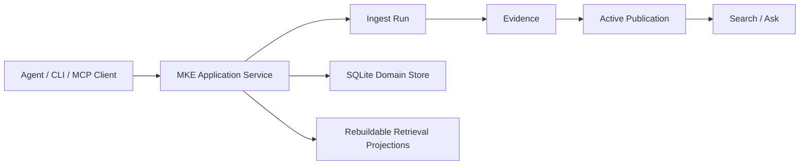

# Multimodal Knowledge Engine

[English](./README.md) | [中文](./README_CN.md)

Multimodal Knowledge Engine 是一个本地优先、可被 Agent 调用的 Evidence 引擎，用于导入、检索和问答文档与媒体资料。

`v0.1.0` 是第一个公开小版本。它证明的是一条刻意收窄但完整的本地 Evidence 闭环：可观察 ingest
Runs、active Publication Search、evidence-only Ask，以及 CLI 和 stdio MCP server 共享的一套
application contract。它不是托管 RAG 平台。

## Verified in v0.1.0

| Capability | Evidence |
|---|---|
| Evidence lifecycle | 成功 Run 可以发布 Evidence；失败或部分处理不会进入可检索状态。 |
| text-layer PDF + short video fixture ingest | proof/demo fixtures 覆盖 text-layer PDF ingest 和文档化的短本地视频 fixture。 |
| active-Publication Search | Search 读取 active Publications，并返回稳定页码或时间戳 Evidence。 |
| evidence-only Ask / insufficient_evidence | Ask 返回带引用的 Evidence 或 `insufficient_evidence`；当前 slice 不做 LLM answer generation。 |
| CLI + stdio MCP same application contract | CLI commands 和 MCP tools 使用同一 application service layer。 |
| cjk-active-scan-overlap-v1 default owner-startup strategy | `cjk-active-scan-overlap-v1` 是已发布的 owner-startup CJK retrieval default。 |
| proof/demo/installed-wheel consumer smoke | `mke proof run`、`mke demo --verify` 和 installed-wheel consumer smoke 都是 release gates。 |



SQLite 是 first Pilot 的 domain truth。Retrieval indexes 是可重建 projections，Assets 和
Artifacts 不可变，Search/Ask 只读取 active Publications。

## 快速验证

```bash
uv sync --locked
uv run mke proof run
uv run mke demo --verify
```

完整 release verification 命令集：

```bash
uv run pytest -q
uv run ruff check .
uv run pyright
uv build
uv run mke proof run
uv run mke demo --verify
uv run python scripts/release_presentation_audit.py --root .
uv run python scripts/release_consumer_smoke.py --wheel dist/*.whl --json
```

## CLI 与 MCP

核心 CLI 路径使用本地 SQLite database：

```bash
uv run mke --db .tmp/mke.sqlite ingest tests/fixtures/pdf/text-layer.pdf
uv run mke --db .tmp/mke.sqlite search trustworthy
uv run mke --db .tmp/mke.sqlite ask "publication active"
uv run mke --db .tmp/mke.sqlite run get <run_id>
```

Agent-facing MCP server 通过 stdio 运行，并复用同一 application service layer：

```bash
uv run mke --db .tmp/mke.sqlite mcp --allowed-root .
```

MCP tools 可以导入 allowed local files、检查 Runs、Search active Evidence，以及执行
evidence-only Ask。MCP request 不能覆盖 provider、model、download policy 或 request-time
retrieval strategy。

## 当前 CJK Runtime

`cjk-active-scan-overlap-v1` 是已发布 runtime default。它会用 numeric policy 编译每个 query：

- compiled non-empty query 始终走 active FTS5，包括 zero-hit；
- eligible compiled-empty CJK query 使用 active Publication Evidence 上的有界扫描；
- ineligible compiled-empty query 返回稳定 validation result。

Active scan 不创建 persistent CJK projection，也不需要 migration。主要 rollback strategy 是
`numeric-grouping-v1`；`current` 保留为更底层 rollback。

```bash
uv run mke --db .tmp/mke.sqlite \
  --retrieval-strategy cjk-active-scan-overlap-v1 \
  search "蓝湖缓存服务 不完整索引"
```

## E3 Release Decision Table

| Stage | Result | Runtime impact |
|---|---|---|
| E3-A Chinese baseline | Baseline recorded; current lexical miss modes identified. | None |
| E3-B CJK lexical candidate | `cjk-trigram-overlap-v1` comparison passed. | None |
| E3-F CJK active-scan runtime | `cjk-active-scan-overlap-v1` promoted as default owner-startup strategy. | Shipped runtime |
| E3-C dense candidate | Qwen3 exact-cosine dense comparison completed; E3-D eligible. | None |
| E3-D RRF fusion | Valid negative; recall improved but refusal collapsed. | None |
| E3-E relevance gate/reranker | Development passed, holdout observed, holdout gate failed. | None |

E3-C dense、E3-D RRF、E3-E relevance-gate/reranker 在 `v0.1.0` 中都是 comparison-only
evidence，不是 runtime behavior。它们不改变 Search、Ask、MCP、owner startup、Publication、
ingestion 或 runtime defaults。

## 边界

`v0.1.0` 不包含 dense retrieval execution、hybrid/RRF execution、reranker execution、query
rewrite、HyDE、segmentation rewrite、scanned-PDF OCR、任意视频处理、HTTP、UI、public API
adapter、LangChain、LlamaIndex、LangGraph、Milvus、Redis、pgvector、bundled model weights 或托管
多租户协调。

可选 local transcription 和 embedding 路径仍是显式 operator action。它们不是 core proof、demo、
CLI ingest、MCP execution 或 consumer smoke 的要求。

## 文档

- [Release notes](./docs/releases/v0.1.0.md)
- [Verify The Release](./docs/how-to/verify-release.md)
- [Documentation index](./docs/README.md)
- [Run The Local Product Proof](./docs/how-to/run-local-product-proof.md)
- [Use MKE As A Local MCP Server](./docs/how-to/use-mke-mcp.md)
- [Enable Bounded CJK Retrieval](./docs/how-to/enable-cjk-retrieval.md)
- [Run Retrieval Evaluation](./docs/how-to/run-retrieval-evaluation.md)
- [Run The Chinese Retrieval Evaluation](./docs/how-to/run-chinese-retrieval-evaluation.md)
- [Prepare Local Embeddings](./docs/how-to/prepare-local-embeddings.md)
- [Evaluate The Dense Retrieval Candidate](./docs/how-to/evaluate-dense-retrieval.md)
- [Evaluate The Hybrid RRF Retrieval Candidate](./docs/how-to/evaluate-hybrid-rrf-retrieval.md)
- [Evaluate The Relevance Gate Reranker Candidate](./docs/how-to/evaluate-relevance-gate-reranker.md)

长期架构决策在 [docs/decisions/](./docs/decisions/)。已批准的实施历史在
[docs/superpowers/](./docs/superpowers/)。

## 开发

```bash
uv run pytest -q
uv run ruff check .
uv run pyright
uv build
```

开发流程见 [CONTRIBUTING.md](./CONTRIBUTING.md)，安全漏洞报告方式见 [SECURITY.md](./SECURITY.md)。

## License

MIT，详见 [LICENSE](./LICENSE)。
